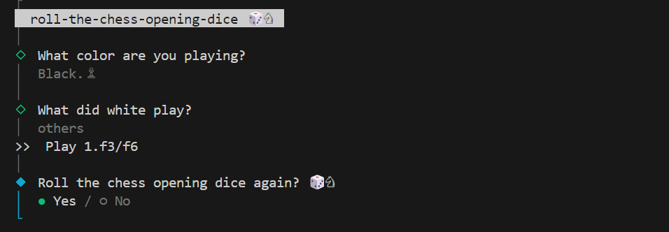

# 🎲 Roll the Chess Opening Dice

A fun, lightweight CLI app that helps you break out of your opening prep rut by randomly suggesting chess openings for White or Black — or even generating totally random first moves. Great for practice, chaos, or just shaking things up!

---

## 🚀 Features

- 🎯 Random opening suggestions for **White**
- ♟ Tailored Black responses based on White's first move (e4, d4, c4, others)
- 🎲 Wild card: Get a **totally random first move** (for both colors)
- 🖥 Interactive CLI using `@clack/prompts`
- 🏁 Colored terminal output via `picocolors`

---

## 📦 Installation

Clone the repo and run it locally with Node.js:

```bash
git clone https://github.com/M-Lenox/roll-the-chess-opening-dice.git
cd roll-the-chess-opening-dice
npm install
node main.js
```

## 🧠 Usage

Choose:

- `White` – Get a surprise first move suggestion
- `Black` – Select what White played, and get a counter-opening
- `Random` – Embrace the dice! Play a totally random move

## 🛠 Tech Stack

- Node.js
- `@clack/prompts` – for interactive CLI prompts
- `picocolors` – for clean, minimal terminal colors

## 💡 Example Output



## 📄 License

MIT License
